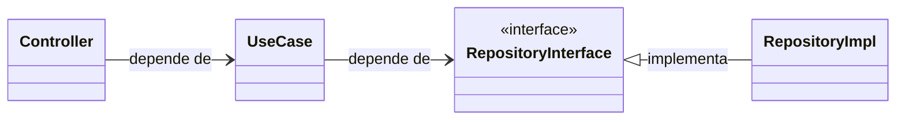

[](https://git.io/typing-svg)

Desafio Backend para a empresa [Contato Seguro]

# O Desafio

Criar uma API RESTful para um sistema simples de gerenciamento de tarefas (To-Do List). O sistema deve ter duas entidades principais, onde toda tarefa deve estar relacionada a um usuário

### Usuário
- Criar um Usuário
- Editar um Usuário
- Deletar um Usuário
- Listar todos os usuários
- Obter usuário por ID 

### Task
- Criar uma Task
- Editar uma Task
- Deletar uma Task
- Listar todas as Tasks
- Listar todas as Tasks por usuário

## Solução

  - A solução seguiu os requisitos do desafio e também implementou os requisitos diferenciais, aplicando testes unitários, automatização com docker, listagem de tarefas por usuário e documentação com swagger.
  - A escolha da arquitetura foi baseada em Clean Architecture em módulos organizados por contexto e aplicação de SOLID.
  -  A inicialização do container via Docker Compose valida a saúde da API via health check em `/health`.

#### Decisão de Arquitetura de Dependência (Controller - Use Case - Interface)


## Comece por aqui (Linux Debian)

   > Este guia foi projetado para funcionar via CLI em Sistemas Operacionais baseados em Debian, caso tenha um sistema operacional diferente, adapte ao seu sistema.
 
  ### O Projeto pode ser executado utilizando Docker Compose (RECOMENDADO)
  - Caso não saiba como instalar e configurar o Docker, siga a documentação: https://docs.docker.com/engine/install/

 
  Com o Docker instalado, utilize o comando para iniciar o projeto:
  > Lembre-se de navegar até a pasta que contém o docker-compose.yaml
  ```
  docker compose up -d
  ```
  Desta forma, provavelmente seu projeto já terá sido iniciado!

  Caso queira parar o projeto, utilize:
  ```
  docker compose down
  ```

  ### Caso tenha erros com a porta 27017

  Caso ocorra algum problema de "port already in use", o projeto utiliza a porta 27017 para executar o banco de dados (Padrão do Mongodb).
  Lembre-se de fechar qualquer serviço que esteja utilizando essa porta
  
  Utilize o comando:
  ```
  sudo systemctl stop mongod
  ```
  Isso pausará o mongodb do seu host, mas não se preocupe, após testar a API, poderá ativar seu mongodb local novamente com o comando:

  ```
  sudo systemctl start mongod
  ```
  ## Como Testar
  Com o projeto rodando utilize o swagger para realizar testes nos end-points! No navegador digite: `http://localhost:3000/api-docs`

### Ferramentas Utilizadas
- TypeScript para Desenvolvimento com NodeJs
- ExpressJS como servidor web
- Mongoose (MongoDB) como banco de dados (ORM) 
- Docker Compose para automatização de containers docker
- Jest para Testes Unitários
- Yup para validação de inputs
- Swagger 2.0 para Documentação da API
